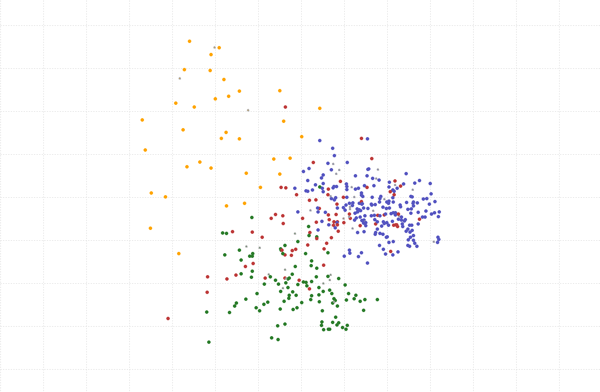
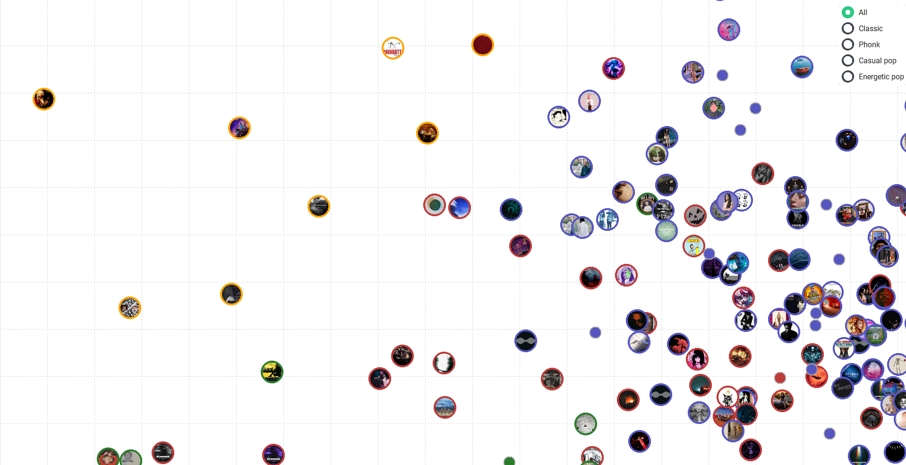

# Spotify Song Clustering

This project analyzes your Spotify listening history, clusters your most-played songs using deep audio embeddings and unsupervised learning, and provides interactive visualizations of the results.

## Features
- **Automated Data Preprocessing:** Cleans and aggregates your Spotify streaming history from exported JSON files.
- **Automated Downloading:** Downloads your most-listened songs and their cover images.
- **Audio Embedding Extraction:** Uses OpenL3 to generate deep audio embeddings for each song.
- **Clustering:** Groups songs into clusters using KMeans and visualizes them in 2D space with PCA.
- **Interactive Visualization:** Explore your music clusters with a Tkinter-based GUI, including zoom, pan, and cluster filtering.

## Example Visualizations

Below are example outputs of the clustering and visualization process:





## Project Workflow

1. **Data Preprocessing** (`preprocessing.ipynb`):
   - Load your Spotify streaming history JSON files into the `data/` folder.
   - The notebook cleans, aggregates, and filters your data, then downloads each song and its cover using the `SpotiDownloader` class.

2. **Downloading Songs and Covers** (`downloader.py`):
   - Automates downloading of songs (from spotidown.app) and covers (from spotifycover.art) using Selenium and requests.

3. **Audio Embedding Extraction** (`embed.py`):
   - Extracts OpenL3 audio embeddings for each song and saves them in `files/embedings.pkl`.

4. **Clustering and Dimensionality Reduction** (`fit.py`):
   - Loads embeddings, scales and reduces them with PCA, clusters with KMeans, and evaluates clustering quality.
   - Saves the final clustered data in `files/song_clusters.pkl`.

5. **Interactive Visualization** (`app.py`):
   - Loads clustered data and launches a Tkinter GUI to visualize your music clusters interactively.

## Directory Structure

```
Spotify Project/
├── app.py                  # Interactive visualization app
├── downloader.py           # Song and cover downloader
├── embed.py                # Audio embedding extraction
├── fit.py                  # Clustering and dimensionality reduction
├── preprocessing.ipynb     # Data preprocessing notebook
├── data/                   # Your Spotify streaming history JSON files
├── files/
│   ├── embedings.pkl       # Audio embeddings
│   ├── song_clusters.pkl   # Clustered data for visualization
│   ├── visualization1.png  # Example cluster visualization
│   └── visualization2.png  # Example cluster visualization
├── requirements.txt        # Python dependencies
└── README.md               # Project documentation
```

## Setup

1. **Clone the repository and install dependencies:**
   ```bash
   pip install -r requirements.txt
   ```

2. **Prepare your data:**
   - Export your Spotify streaming history and place the JSON files in the `data/` folder.

3. **Run the workflow:**
   - Open and run `preprocessing.ipynb` to preprocess data and download songs/covers.
   - Run `embed.py` to extract audio embeddings.
   - Run `fit.py` to cluster and prepare data for visualization.
   - Run `app.py` to launch the interactive visualization GUI.

## Requirements
See `requirements.txt` for all dependencies. Key packages include:
- pandas
- scikit-learn
- tqdm
- openl3
- soundfile
- requests
- selenium
- customtkinter
- pillow

## Notes
- The downloader uses Selenium and Chrome WebDriver. Make sure you have Chrome installed and the appropriate driver available in your PATH.
- The project will create `songs/` and `covers/` folders for downloaded files.
- The interactive visualization supports zoom, pan, and cluster filtering.

## License
MIT License
